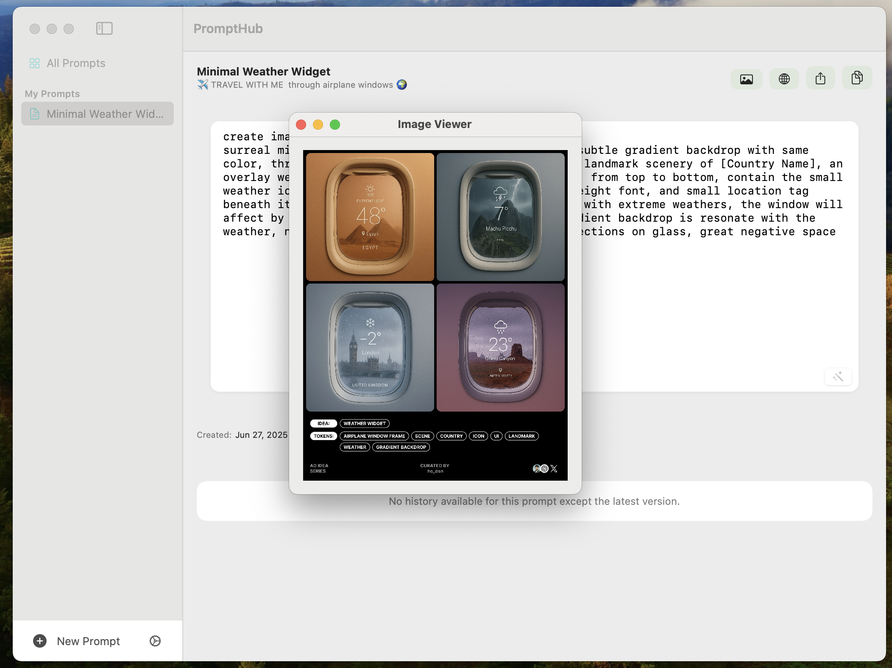

 

# PromptHub

**A powerful tool for managing and organizing your prompts**

PromptHub helps you better organize your prompts with comprehensive features including creating, editing, deleting, searching, and viewing prompts. Built with SwiftUI for macOS.

## ✨ Features

- ✅ **Create Prompt** - Add new prompts with ease
- ✅ **Edit Prompt** - Modify existing prompts
- ✅ **Delete Prompt** - Remove unwanted prompts
- ✅ **View Prompt** - Browse and preview prompts
- ✅ **Search Prompt** - Find prompts quickly
- ✅ **Status Bar** - Quick access from menu bar
- ✅ **Export/Import** - Share prompts across devices
- ✅ **AI Optimization** - Enhance prompts with AI
- ✅ **History** - Track prompt usage
- ✅ **Share Prompt** - Collaborate with others
- ✅ **Internationalization** - Chinese & English support
- ✅ **Prompt Gallery** - Discover default prompts

## 📸 Screenshots

  <table>
    <tr>
      <td align="center">
        
         
        <b>Home Page</b>
      </td>
      <td align="center">
        
         
        <b>Add Prompt Dialog</b>
      </td>
      <td align="center">
        
         
        <b>Prompt Preview</b>
      </td>
    </tr>
  </table>

