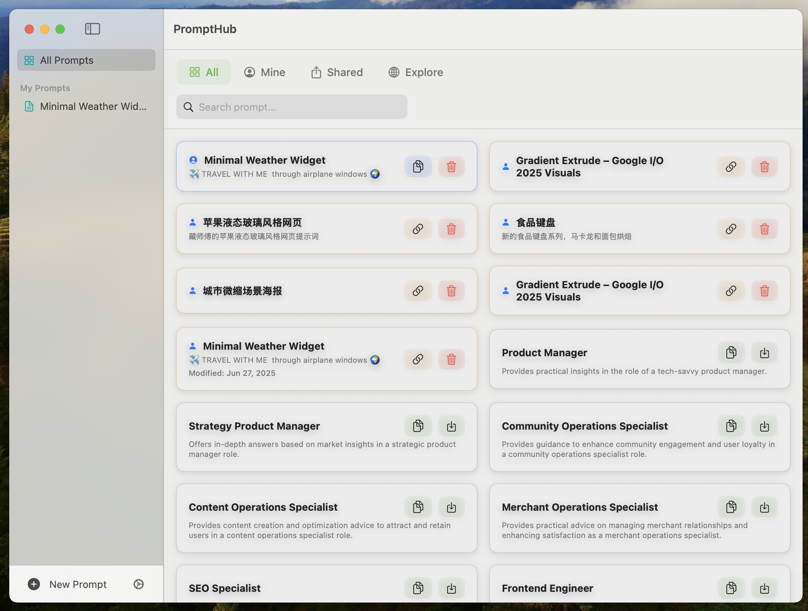
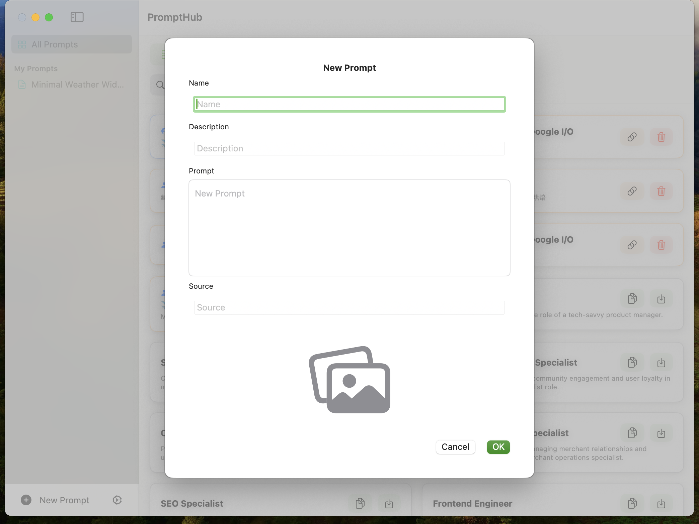

 

# PromptHub

<h3>PromptHub</h3>

PromptHub is a tool for managing prompts that helps you better organize your prompts, including operations like creating, editing, deleting, and viewing.

## Roadmap

- [x] Create Prompt
- [x] Edit Prompt
- [x] Delete Prompt
- [x] View Prompt
- [x] Search Prompt
- [x] Status Bar
- [ ] Export Prompt
- [ ] Import Prompt
- [ ] AI Prompt Optimization

## Screenshots

