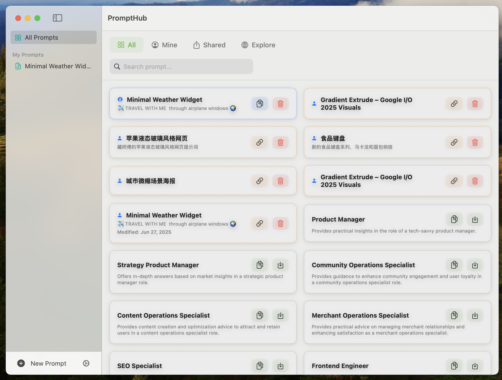
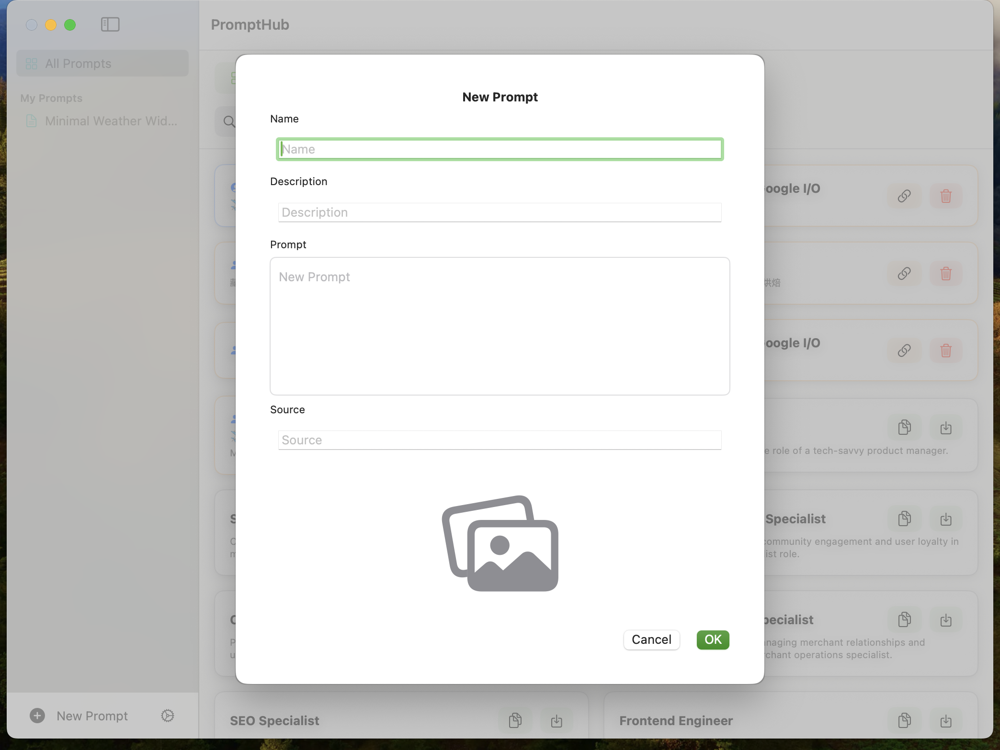
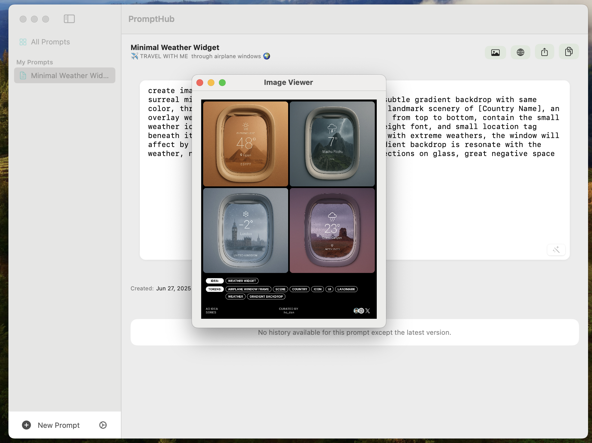
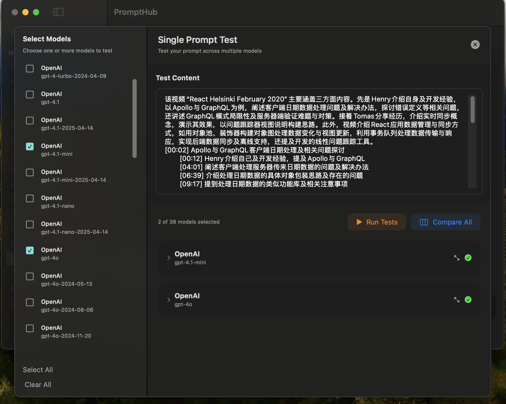
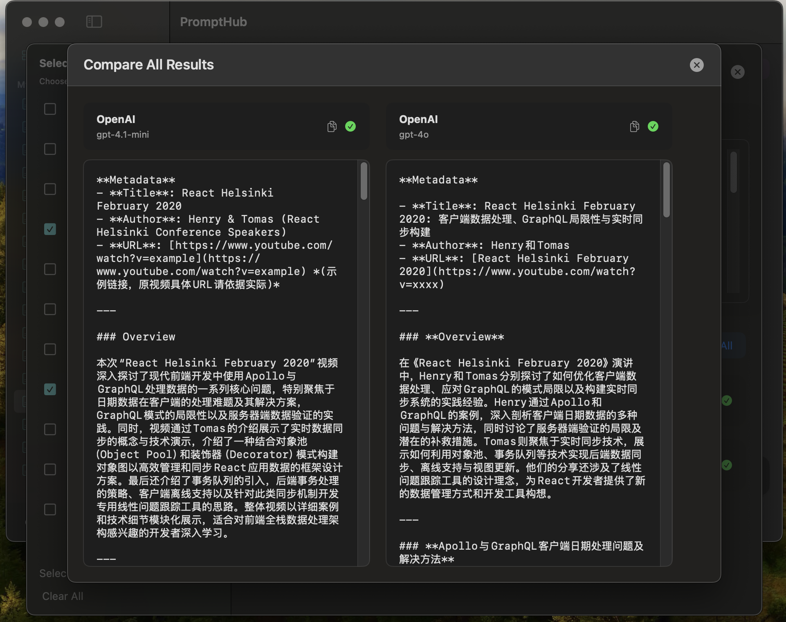
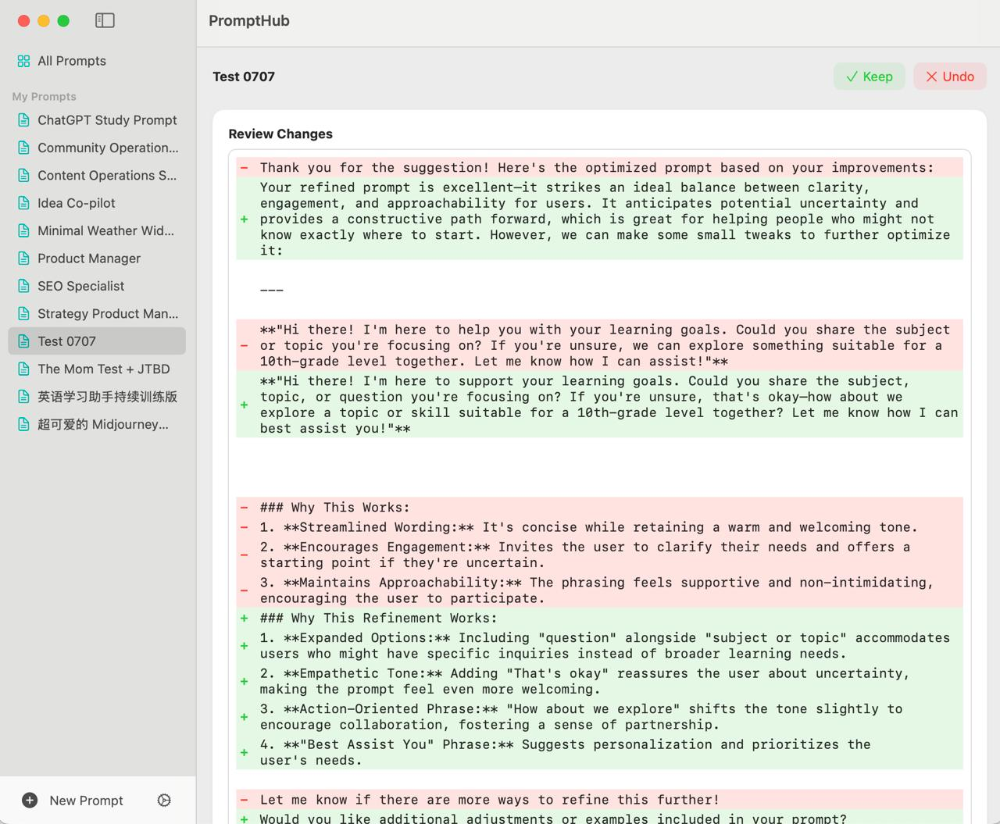

 

# PromptHub

**A powerful tool for managing and organizing your prompts**

PromptHub helps you better organize your prompts with comprehensive features including creating, editing, deleting, searching, and viewing prompts. Built with SwiftUI for macOS.

## ✨ Features

- ✅ **Create Prompt** - Add new prompts with ease
- ✅ **Edit Prompt** - Modify existing prompts
- ✅ **Delete Prompt** - Remove unwanted prompts
- ✅ **View Prompt** - Browse and preview prompts
- ✅ **Search Prompt** - Find prompts quickly
- ✅ **Status Bar** - Quick access from menu bar
- ✅ **Export/Import** - Share prompts across devices
- ✅ **AI Optimization** - Enhance prompts with AI
- ✅ **History** - Track prompt usage
- ✅ **Share Prompt** - Collaborate with others
- ✅ **Internationalization** - Chinese & English support
- ✅ **Prompt Gallery** - Discover default prompts
- ✅ **Prompt Diff** - Compare prompt generated by ai
- 🆕 **Single Prompt Testing** - Test prompts across multiple AI models simultaneously
- 🆕 **Model Comparison** - Compare results from different AI models side-by-side
- 🆕 **Real-time Streaming** - Watch AI responses generate in real-time
- 🆕 **Global Results View** - View all model results in a comprehensive comparison interface
- 🆕 **CLI Agent Skills** - Install, configure, and manage skills for popular CLI agents (Claude Code, Cursor, Codex, Gemini CLI, etc.)
- 🆕 **Granular Sandbox Access** - Securely grant access only to specific CLI hidden folders (e.g. `~/.claude`) without exposing your entire Home directory

## 🤖 CLI Agent Skills Management

PromptHub introduces a unified interface to manage context and skills for various AI CLI tools:

- **Unified Skill Store**: Discover and install open-source skills from `skills.sh`
- **Multi-Agent Support**: Compatible with Claude Code, Cursor, Codex, Gemini CLI, iFlow, Qwen Code, and Qoder
- **Secure Sandbox Access**: Granular control over which CLI configuration folders PromptHub can access, fully compliant with macOS App Store Sandbox restrictions
- **Drafts & Previews**: Edit skills securely in local drafts before publishing them to the CLI folders
- **Project Scope**: Install skills globally or restrict them to a specific project folder

### PromptHub CLI Package

The standalone CLI now lives in `PromptHubCLI/` and exposes a real `ph` executable for exported prompts and agent skill operations.

- Build locally: `swift build --package-path PromptHubCLI -c release --product ph`
- Test locally: `swift test --package-path PromptHubCLI`
- Install with Homebrew from the repo tap: `brew tap LeetaoGoooo/PromptHub https://github.com/LeetaoGoooo/PromptHub.git && brew install --HEAD LeetaoGoooo/PromptHub/ph`
- Command examples: `ph prompt list`, `ph prompt show`, `ph skill exports`, `ph skill install`, `ph skill list`
- Release automation: pushing a `ph-vX.Y.Z` tag triggers the GitHub Actions workflow that publishes a release binary, while Homebrew installs flow through `Formula/ph.rb` in the repository tap

See `PromptHubCLI/README.md` for install and release details.

## 🧪 Prompt Testing Features

PromptHub now includes powerful prompt testing capabilities that allow you to:

### Multi-Model Testing
- **Select Multiple Models**: Choose from all configured AI services and models
- **Parallel Execution**: Run tests across multiple models simultaneously for faster results
- **Service Management**: Easy configuration of different AI service providers

### Real-time Results
- **Streaming Responses**: Watch AI responses generate in real-time as they stream
- **Live Updates**: See results update dynamically across all selected models
- **Progress Indicators**: Visual feedback for ongoing tests

### Comparison Tools
- **Side-by-Side View**: Compare outputs from different models in organized cards
- **Global Comparison**: Full-screen comparison view for detailed analysis
- **Expandable Results**: Collapse/expand individual results for better organization
- **Full-Screen Mode**: View individual results in dedicated full-screen windows

### User Experience
- **Model Selection Sidebar**: Intuitive interface for selecting and managing test models
- **Test Controls**: Easy-to-use controls for running tests and managing results
- **Error Handling**: Clear error messages and status indicators
- **Copy to Clipboard**: Quick copying of results for further use

## 📸 Screenshots

  <table>
    <tr>
      <td align="center">
        
         
        <b>Home Page</b>
      </td>
      <td align="center">
        
         
        <b>Add Prompt Dialog</b>
      </td>
      <td align="center">
        
         
        <b>Prompt Preview</b>
      </td>
    </tr>
    <tr>
      <td align="center">
        
         
        <b>Multi-Model Testing</b>
      </td>
      <td align="center">
        
         
        <b>Global Comparison View</b>
      </td>
      <td align="center">
        
         
        <b>Prompt Diff</b>
      </td>
    </tr>
  </table>

